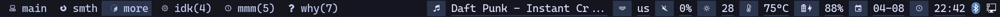
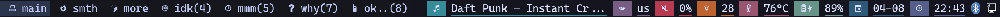

slowly building something i like (and learning so much from it!!!) (i know very little but i love learning/knowledge in general, so !)

my favourite out of the i3blocks configs i did:

another (less depressing) one:

an old one i don't really like:

(i really have nothing to do):

https://github.com/user-attachments/assets/38080900-d7d3-4f79-a99f-0426eea61dad

(this now changes my keyboard RGB too!)
(it's just a script that moves stuff around, nothing fancy)
